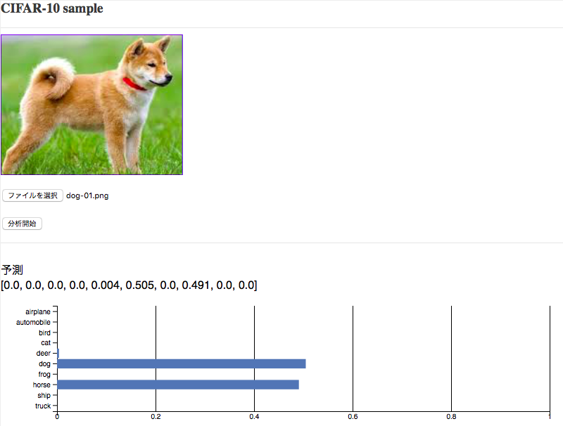

# Watson Machine Learning サンプルアプリ

## アプリケーションの説明
このアプリケーションは**Watson Studio**の**Neural Network Designer**で作ったCI-FAR10(犬、猫、船など10種類のイメージ)を認識する深層学習モデルにWebサービス経由でアクセスし、アップロードしたイメージデータの動物、乗り物などを判断します。  

  

## 前提
Watson Studio上で、CIFAR-10認識のための深層学習モデルの構築、学習、保存、WEBサービス化、テストまでできていることが前提です。  
詳細手順に関しては、[Watson Studioで深層学習。KerasサンプルアプリをGPU+TensorBoardで動かす](https://qiita.com/makaishi2/items/1fc28f5039798a883aef)などを参照して下さい。

## CFコマンドの導入
CFコマンドがまだ使えない場合は、導入を行います。
[Cloud Foundryコマンドラインツール][cloud_foundry]  
注意: Cloud Foundaryのバージョンは最新として下さい。 

## ソースのダウンロード
Githubからアプリケーションのソースをダウンロードします。  
カレントディレクトリのサブディレクトリにソースはダウンロードされるので、あらかじめ適当なサブディレクトリを作り、そこにcdしてから下記のコマンドを実行します。  
GITコマンドを使わない場合は、[Github](https://github.com/makaishi2/wml-cifar10-sample)にブラウザからアクセスして、zipファイルをダウンロード後、解凍します。  
ダウンロード後、できたサブディレクトリにcdします。  
以下はgitコマンドを使う場合の例です。
 

```sh
$ cd (適当なサブディレクトリ)
$ git clone https://github.com/makaishi2/wml-cifar10-sample.git
$ cd wml-cifar10-sample
```

## CFコマンドでログイン
CFコマンドでIBM Cloud環境にログインします。  
ログイン名、パスワードはIBM Cloudアカウント登録で登録したものを利用します。  
ログインに成功すると、次のような画面となります。  

```
$ cf api https://api.ng.bluemix.net
$ cf login
```

  

## Watson MLサービス名称の確認
次のコマンドを実行し、Watson MLのサービス名称を確認します。

```
$ cf s | grep pm-20
```

結果がまったく返ってこない場合は、Watson Machine LearningがIAMサービスになっていると考えられます。
その場合は、以下のリンク先の手順に従い、エイリアス定義を行って下さい。

[IBM Cloud IAM対応のためのtips](https://qiita.com/makaishi2/items/ab2290e471fbff245b6a)

以下では、Watson MLサービス名を``<pm-20-name>``であるとします。

## アプリケーションのデプロイ

次のコマンドを実行します。
**\<service_name\>** はなんでもいいのですが、インターネット上のURLの一部となるので、ユニークな名前を指定します。  
(例) **wml-cifar10-aka**

```
$ cf push <service_name>
```

デプロイには数分かかります。

## サービスのバインド・環境変数の設定

次のcfコマンドでサービスのバインドとエンドポイントURLの設定を行います。
scoring_urlは、Watson StudioのWebサービス管理画面->Implementationタブの**Scoreing End-point**の欄に記載があるので、コピペして利用します。
コマンドのうちrgコマンド(アプリケーションの再構築)に数分の時間がかかります。

```
$ cf ns <service_name> <pm20-name>
$ cf se <service_name> SCORING_URL <scoring_url>
$ cf rg <service_name>
$ cf a
```

## アプリケーションのURLと起動

デプロイが正常に完了したらアプリケーションを起動できます。  
最後のコマンド出力からアプリケーションのURLを調べて、そのURLをブラウザから入力して下さい。URLは通常下記の形になっています。

```
https://<service_name>.mybluemix.net/
```

## テスト
テスト用のサンプルイメージをsample_imagesにいれておきました。
アプリのテスト時にお使い下さい。
なお、機械学習モデルの解像度に合わせるため、アップロードしたイメージは32x32のサイズに縮小されます。

## アプリケーションを修正する場合

アプリケーションを修正したい場合は、ローカルのソースを修正し、再度 ``cf push <service_name>`` コマンドを実行すると、IBM Cloud上のアプリケーションが更新されます。  

## ローカルで起動する場合

アプリケーションを修正する時は、ローカルでもテストできる方が便利です。そのための手順は以下の通りです。

* Pythonの導入  
ローカルにPython(v3)を導入する必要があります。　MACの場合は最初から導入済みなのでこの手順は不要です。
* 認証情報の確認  
BluemixダッシュボードからWMLサービスの管理画面を開き、接続用の認証情報を調べてテキストエディタなどにコピーします。
* .envファイルの設定  
次のコマンドで.env.exampleファイルの雛形から.envをコピーし、エディタで調べたusername, passwordを設定します。

```sh
$ cp .env.example .env
```

```sh
WML_SERVICE_CREDENTIALS_URL=xxxxx
WML_SERVICE_CREDENTIALS_USERNAME=xxxxxxxx-xxxx-xxxx-xxxx-xxxxxxxxxxxx
WML_SERVICE_CREDENTIALS_PASSWORD=xxxxxxxxxxxx
```

* Pythonアプリケーションの導入、実行  
以下のコマンドでアプリケーションの導入、実行を行います。

```sh
$ python server.py
```

[cloud_foundry]: https://github.com/cloudfoundry/cli#downloads
[git]: https://git-scm.com/downloads
[sign_up]: https://bluemix.net/registration
 
